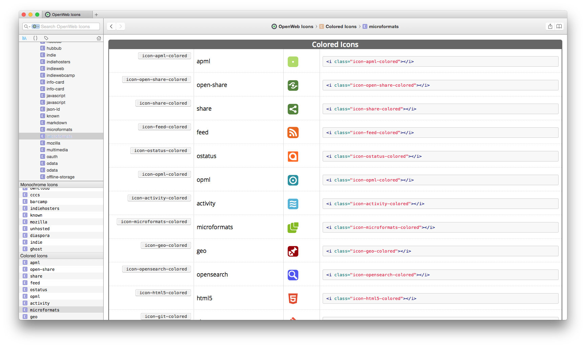

# dash-openwebicons

dash-openwebicons is a docset for [Dash.app][] containing the latest [OpenWeb Icons] Cheatsheet.

## Installing

Install by opening Dash.app preferences, switch to `Downloads`, click `+`, and enter the feed URL
`https://raw.githubusercontent.com/pfefferle/dash-openwebicons/master/openwebicons.xml`.

## Build

To rebuild or update this docset run the following commands in the following order:

1. checkout the [OpenWeb Icons] font: `$ git clone git://github.com/pfefferle/openwebicons.git`
1. install cheatset `$ sudo gem install cheatset`
1. switch to docset folder `$ cd openwebicons/docset`
1. run `$ cheatset generate openwebicons.rb` to build new docset
1. `$ sh pack.sh` to build the tgz file for a new release

## Changelog

### 1.1.0

* updated to version 1.4.0

### 1.0.0

* initial version

## Thanks

[OpenWeb Icons]: https://pfefferle.github.io/openwebicons
[Dash.app]: http://kapeli.com/dash
[open an issue]: https://github.com/pfefferle/dash-openwebicons/issues
[`pack.sh`]: https://github.com/pfefferle/dash-openwebicons/blob/master/pack.sh
